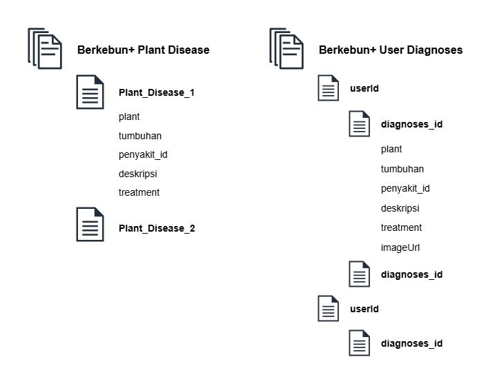

# Berkebun+ Cloud Computing Backend APIs 🌱

This repository contains the Backend APIs for Berkebun+ Capstone Project.

## 📂 Project Structure

```plaintext
Cloud-Computing/
│
├── src/
│   ├── api
│   |    ├── diagnose.js
│   |
│   ├── exceptions
│   |    ├── ClientError.js
|   |    ├── InputError.js
|   |
│   ├── server
│   |    ├── routes.js
|   |    ├── server.js
|   |
│   ├── services
│        ├── firestoreData.js
|        ├── uploadData.js
|
|
├── .gitignore
├── package-lock.json
├── package.json
├── README.md
```

## 🎯 Feature

 <ul>
    <li>
        <b>Diagnose endpoint</b><br></br>
        <pre><b>POST</b> /diagnoses</pre>
        <p>For getting the plant diagnoses from ML-CC-backend /predict</p>
    </li>
    <li>
        <b>Save specific users plant diagnosed endpoint</b><br></br>
        <pre><b>POST</b> /diagnoses/{userId}/save</pre>
        <p>For saving specific plant diagnosed to user data</p>
    </li>
    <li>
        <b>Get all users plant diagnosed endpoint</b><br></br>
        <pre><b>GET</b> /diagnoses/{userId}</pre>
        <p>For getting all the plant diagnosed from user data</p>
    </li>
    <li>
        <b>Get specific users plant diagnosed endpoint</b><br></br>
        <pre><b>GET</b> /diagnoses/{userId}/{diagnosedId}</pre>
        <p>For getting specific plant diagnosed from user data</p>
    </li>
    <li>
        <b>Delete specific users plant diagnosed endpoint</b><br></br>
        <pre><b>DELETE</b> /diagnoses/{userId}/{diagnosedId}</pre>
        <p>For delete specific plant diagnosed from user data</p>
    </li>
 </ul>

## 🛠️ Technologies used

This project leverages the following technologies:

<ul>
    <li>
    Backend Framework: Hapi.js
    </li>
    <li>
    Database: Google Firestore
    </li>
    <li>
    Cloud Storage: Google Cloud Storage
    </li>
    <li>
    Environment Management: dotenv
    </li>
    <li>
    HTTP Requests: Axios
    </li>
    <li>
    Form Handling: form-data
    </li>
    <li>
    Authentication/Permissions: Firebase Admin SDK
    </li>
</ul>

## 🌩️ Cloud Architecture


## 🏃 Running Locally

1. Clone this repository

```plaintext
    git clone https://github.com/CP-Berkebun/Cloud-computing.git
```

2. Install all the dependecies

```plaintext
    npm install
```

3. Running the project

```plaintext
    npm run start/dev
```

## ⚙️ Environment

Your .env configuration should looks like

```plaintext
PROJECT_ID=           # Google Cloud Project ID.
USER_BUCKET=          # Cloud Storage Bucket name for saving the user image.
SERVICE_ACCOUNT=      # Service Account Path.
URL_ML=               # Machine Learning URL.
PORT=
```

## 🗄️ Database structure



## 💡 About this repo

This Backend was created by cloud computing cohort:

<ul>
    <li>
       <a href="https://github.com/afifrahadi">Afif Imam Rahadi</a>
    </li>
    <li>
        <a href="https://github.com/HafizIkhsan">Muhammad Hafiz Ikhsan</a>
    </li>
</ul>
